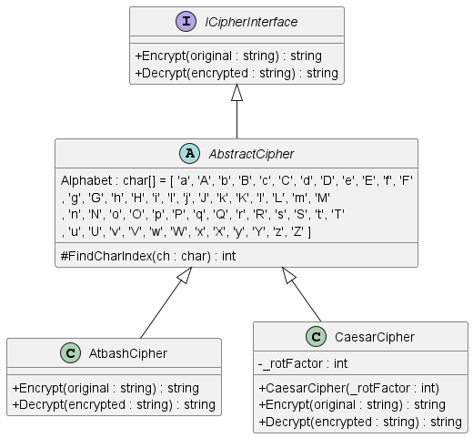
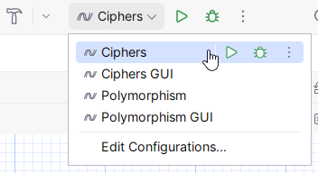
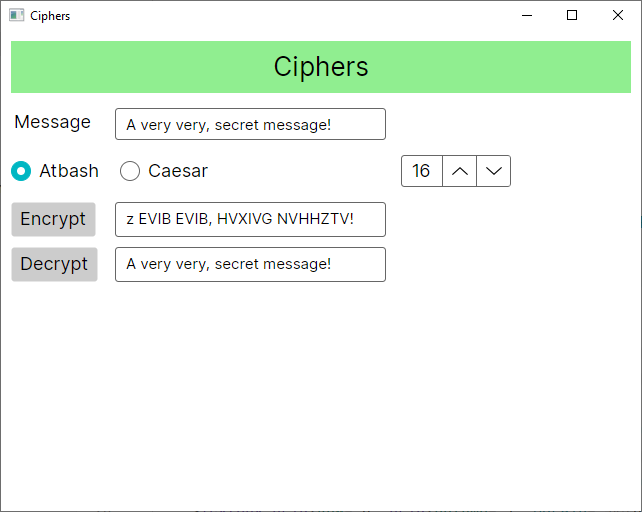

# Ciphers

## Tasks

### Task 1 - Implementation of the hierarchy for ancient encryption of texts

**Background**: The need for sending messages which are only readable by the intended recipient of the message, has existed since antiquity. In this exercise you’ll program such an ancient cipher.

- `AtbashCipher`: Originates from around. Year 500 BC, where it was used alongside the hebraic Alphabet. The general idea is that you replace the 1st letter of the Alphabet with last, the 2nd letter with the second to last and the 3rd letter with the 3rd to last and so on.

- `CaesarCipher`: Was invented under Julius Caesar (100 BC - 44 BC). The procedure is that all letters in the original message are replaced with a letter that is a given number of places (the key) further down in the Alphabet modulus Alphabet length.

**Class Diagram**:



**Supplied code**:

- `ICipherInterface.cs`: The interface contains 2 methods that are declared for encrypting and decrypting a string.
- `CipherDriver.cs`: A class used for testing without a user interface.
- `AbstractCipher.cs`: A class which implements the `ICipherInterface` and contains a method for locating the index of a given letter in the Alphabet. The `Alphabet` constant is an array of chars, consisting of both capitalized and un-capitalized letters from the english Alphabet. The array must be perceived as
  circular, meaning that the sequence: ...., 'y', 'Y', 'z', 'Z' is followed by 'a', 'A', 'b', 'B', .....
### Task 2 - AbstractCipher
Implement the `FindCharIndex()` method. 
The method returns the index, of the ch in the array “Alphabet”, or -1, if `ch` doesn't exist in the array.
The class must **NOT** implement the functionality of the 2 methods from the interface, but instead contain a method, which the concrete classes can use to locate the index of a given letter in the `Alphabet` array.

### Task 3 - AtbashCipher

This class must inherit __AbstractCipher__. Implement the 2 methods from the interface, like following:

- `public String encrypt(String message)` returns encrypted message, such that every alphabetic character in message is replaced like following: (`’a’` -> `’Z’`, `’A’`-> `’z’`, `’b’` > `’Y’`, and so on.). Remember the non-alphabetic characters, are not changed. This method should first find if the char in the message exists in the Alphabet array, if it exists then the char in the message should be replaced by an appropriate char wrt. AtbAsh encryption, otherwise the char should remain unchanged.
- `public String decrypt(String encrypted)` recreates the original message _Hint: Encrypting the encrypted message, with Atbash, is the same as decrypting it._

### Task 4 - CaesarCipher

Must also inherit AbstractCipher.

- The class must have the following attribute: (`int rotFactor`), which consists of the number of places in `Alphabet`, that a given character must be rotated (The key).
  - Create a constructor which assigns the rotFactor attribute. Ensure that the integer is neither negative nor larger than the number of characters in Alphabet.
- `public String encrypt(String message)` returns encrypted message, like following:
  - every alphabetic character in message is replaced by a character, based on the rotFactor.
  - Remember that the `Alphabet` has to be considered **CIRCULAR** and that _non-alphabetic_ characters are unchanged. This method should first find if the char in the message exists in the _Alphabet_ array, if it exists then the char in the message should be replaced by an appropriate char wrt. `rotFactor`, otherwise the char should remain unchanged.
  - _Hint: The circular index for encryption should be computed like this:
     index = (index + rotFactor) % Alphabet.Length;_

- `public String decrypt(String encrypted)` must recreate the original message. (it must rotate the opposite direction of the encryption method.)
_Hint: The circular index for decryption should be computed like this:
   index = (index + Alphabet.Length - rotFactor) % Alphabet.length;_

**Note:** To test your implementation, you can utilize the `CipherDriver` class. Remember to uncomment the code. 
Two run configurations have been created for you to test your program. 
For testing the implementation, choose the one without "GUI". For testing your Avalonia GUI, choose the one with "GUI".
The run configuration can be seen below:



The correct output from running the CipherDriver class is the following: 
```
Original: 
This is a message, which is secret!

Atbash: 
gSRH RH Z NVHHZTV, DSRXS RH HVXIVG!
This is a message, which is secret!

Caesar with rotFactor of 13: 
aNOY OY G SKYYGMK, CNOIN OY YKIXKZ!
This is a message, which is secret!
```

### Task 5 - Avalonia
**Note:** Remember to choose the run configuration named **GUI** at the end.



Open the `MainWindow.axaml` file. A `Grid` has already been defined, to help you set up the GUI, 
feel free to use it or change it however you like.

You need to add the following:
- A `Label` and `TextBox` for the message that should be encrypted.
- 2 `RadioButton`'s for selecting the type of encryption. Either **Atbash** or **Caesar**. 
- A `ButtonSpinner` for choosing the `_rotFactor` of the `CaesarCipher`. The `ButtonSpinner` object has already been created for you.
  - `<ButtonSpinner Grid.Row="1" Grid.Column="2" Margin="10" Name="Spinner" FontSize="18" AllowSpin="True" Spin="Spinner_OnSpin" >16</ButtonSpinner>`
- A `Button` for calling the encrypt method and a `Label` or `TextBox` for the encrypted message.
- Another `Button` for calling the decrypt method and `Label` or `TextBox` for the message.

You can access the `ButtonSpinner` using its name `Spinner`. Feel free to look in the `Spinner_OnSpin` method for inspiration. 

The 2 `Button`'s must have a common handler, checking which of the 2 `RadioButton`'s are selected, 
and then initializing a local variable of the type `ICipherInterface` as either `AtbashCipher` or `CaesarCiper` 
(with the value of the `ButtonSpinner`).  It must then call either `Encrypt()` 
with the original message in the message field or `Decrypt()` with the encrypted text from the field using the chosen Cipher.

